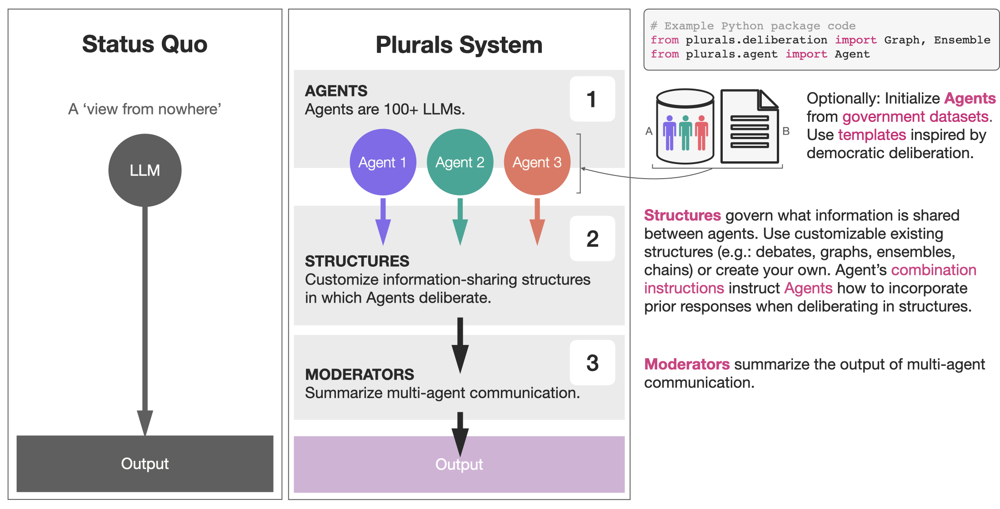

[](https://github.com/josh-ashkinaze/plurals/actions/workflows/pages/pages-build-deployment)


# Cite
Paper coming soon. For now, please cite this package as [](https://doi.org/10.5281/zenodo.12750674):

_Bibtex:_
```
@software{Ashkinaze_Plurals_2024,
  author = {Ashkinaze, Joshua and Fry, Emily and Edra, Narendra and Budak, Ceren and Gilbert, Eric},
  doi = {10.5281/zenodo.12750674},
  license = {cc-by-4.0},
  month = jul,
  title = {{Plurals}},
  url = {https://github.com/josh-ashkinaze/plurals},
  year = {2024}
}
```

_APA:_
```
Ashkinaze, J., Fry, E., Edra, N., Budak, C., & Gilbert, E. (2024). Plurals. Zenodo. https://doi.org/10.5281/zenodo.12750674
```


# Overview


Plurals is an end-to-end generator of simulated social ensembles. (1) **Agents** complete tasks within (2) **Structures**, with communication optionally summarized by (3) **Moderators**. Plurals integrates with government datasets (1a) and templates, some inspired by democratic deliberation theory (1b). 

The building block is Agents, which are large language models (LLMs) that have system instructions and tasks. System instructions can be generated from user input, government datasets (American National Election Studies; ANES), or persona templates. Agents exist within Structures, which define what information is shared. Combination instructions tell Agents how to combine the responses of other Agents when deliberating in the Structure. Users can customize an Agent's combination instructions or use existing templates drawn from deliberation literature and beyond. Moderators aggregate responses from multi-agent deliberation.

# Installation

`pip install plurals`


# Documentation

https://josh-ashkinaze.github.io/plurals/


# Report An Issue or Feature

Plurals is run by a small and energetic team of academics doing the best they can [1]. To report bugs or feature requests, open a GitHub issue. We strongly encourage you to use our Bug or Feature Request issue templates; these make it easy for us to respond effectively to the issue. If you have any questions or want to collaborate on this project, please email jashkina@umich.edu. 

[1] Language adopted from (https://github.com/davidjurgens/potato). 


# Some Potential Uses


- **Persona-based experiments**: Quickly create agents with diverse personas, optionally using ANES for fast, nationally representative samples. Ex: Create a panel of 100 nationally representative personas and process a prompt in parallel with just two lines of code.

- **Deliberation structure experiments**: Generate various multi-agent interactions like ensembles, debates, graphs, or chains of LLM deliberation in just a few lines of code. Test how different information-sharing structures affect outcomes.

- **Deliberation instruction experiments**: Experiment with providing LLMs different instructions for optimally combining information. Compare outcomes across various deliberation protocols.

- **Curation and moderation**: Use Moderator LLMs to filter and select the best outputs from LLMs.

- **Persuasive messaging**: Use many LLMs to collaboratively brainstorm and refine persuasive messaging strategies for different audiences.

- **Decision augmentation**: Enhance human decision-making by providing additional perspectives and information synthesized from multiple AI agents.

- **Ethical guardrails**: Implement customizable ethical checks by having diverse AI agents evaluate potential actions or outputs.

- **Simulated focus groups**: Create and run simulated focus groups.

- **Hypothesis generation**: Use diverse AI perspectives to generate novel hypotheses or research questions in various fields.

- **Creative ideation**: Leverage multiple AI agents with different expertise or viewpoints to generate innovative ideas for various applications.
